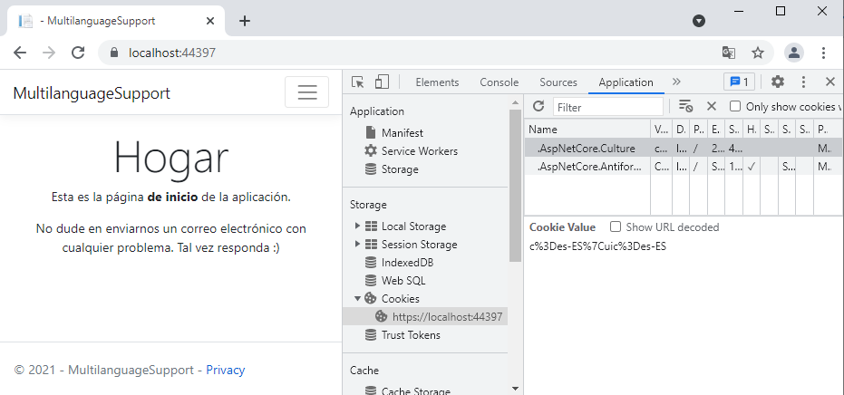
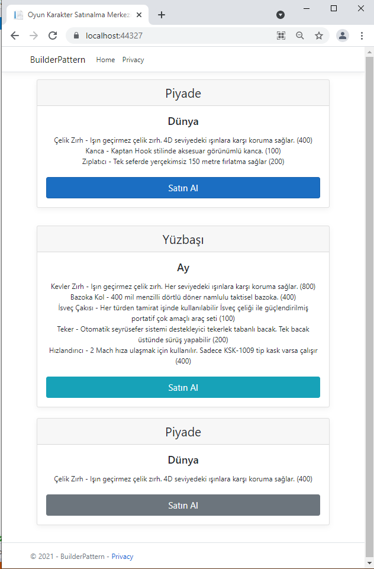
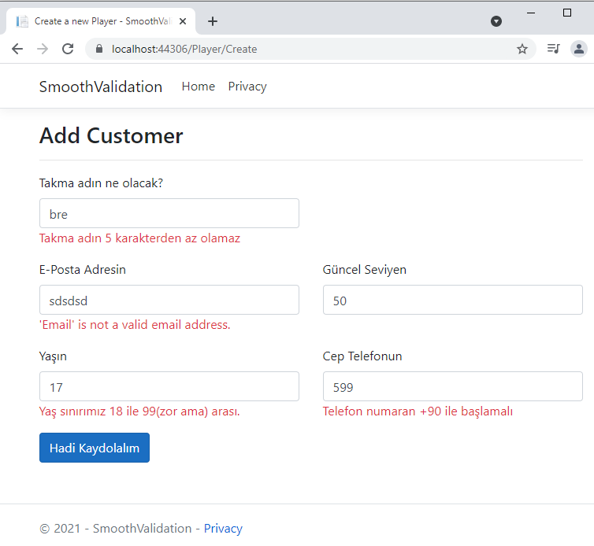

# Cautious Adventures

Bu repoda takip ettiğim web siteleri ve bloglardan bulduğum hafif ölçekteki öğretileri toplamayı planlıyorum. Maksat üşengeçlikten bakmadığım konuları çalışmak olsun.

## ADV01: Asp.Net Core MVC Uygulamalarında Çoklu Dil Desteği

Kaynak : https://www.ezzylearning.net/tutorial/building-multilingual-applications-in-asp-net-core

.Net Core tarafında bir MVC uygulamasına çoklu dil desteği nasıl sağlanır onu öğrendim. Controller ve View için ayrı ayrı üretilebilen Resource dosyaları, koddan ViewData ile metinsel içerik taşıma, IStringLocalizer, IHtmlLocalizer, IViewLocalizer kullanımları ile çalışma zamanında dil değiştirme özelliğinin eklenmesi...İstediğim sonuca ulaştım.

## ADV02: Builder Tasarım Kalıbının Asp.Net Core Tarafında Örnek Kullanımı

Kaynak : https://www.ezzylearning.net/tutorial/builder-design-pattern-in-asp-net-core

Builder desenine uygun bir senaryoda ilerlemek istedim ama çok da içime sinmedi diyebilirim. Yine de desenin temel enstrümanları olan elde edilmek istenen ürünün oluşturulma karmaşıklığını nesne kullanıcısından alan tarafları az biraz sezebildim.

## ADV03: FluentValidation Paketinden Yararlanarak Sayfa Girdilerini Kontrol Altında Tutmak

Kaynak : https://www.ezzylearning.net/tutorial/asp-net-core-data-validations-with-fluentvalidation

FluentValidation ile backend tarafında View ile gelen Model nesnelerini doğrulamak oldukça kolay. Fonskiyon zincirleri ile çeşitli kuralları basitçe tanımlayabiliriz. Anahtar nokta AbstractValidator< T > türevli tiplerin kullanımı. Eğer model nesnemiz başka bir model nesnesini kullanıyorsa, kullandığı nesnenin Validator örneğini de kullanabiliriz _(Bknz. GameValidator nesnesinin kullanımı)_

## ADV04: AutoMapper Kullanımı

Kaynak : https://www.ezzylearning.net/tutorial/a-step-by-step-guide-of-using-automapper-in-asp-net-core

