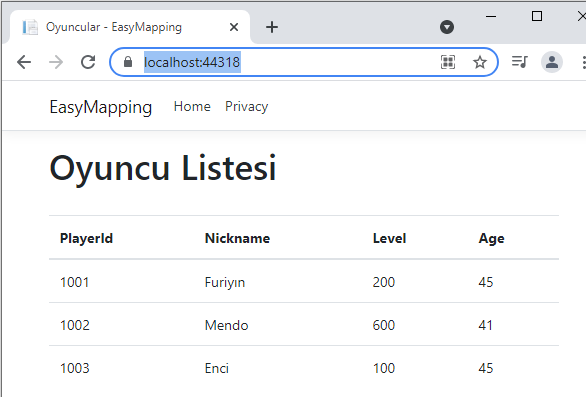
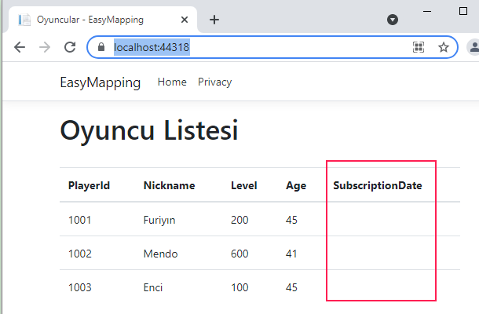

# Cautious Adventures

Bu repoda takip ettiğim web siteleri ve bloglardan bulduğum hafif ölçekteki öğretileri toplamayı planlıyorum. Maksat üşengeçlikten bakmadığım konuları çalışmak olsun.

## ADV01: Asp.Net Core MVC Uygulamalarında Çoklu Dil Desteği

Kaynak : https://www.ezzylearning.net/tutorial/building-multilingual-applications-in-asp-net-core

.Net Core tarafında bir MVC uygulamasına çoklu dil desteği nasıl sağlanır onu öğrendim. Controller ve View için ayrı ayrı üretilebilen Resource dosyaları, koddan ViewData ile metinsel içerik taşıma, IStringLocalizer, IHtmlLocalizer, IViewLocalizer kullanımları ile çalışma zamanında dil değiştirme özelliğinin eklenmesi...İstediğim sonuca ulaştım.

## ADV02: Builder Tasarım Kalıbının Asp.Net Core Tarafında Örnek Kullanımı

Kaynak : https://www.ezzylearning.net/tutorial/builder-design-pattern-in-asp-net-core

Builder desenine uygun bir senaryoda ilerlemek istedim ama çok da içime sinmedi diyebilirim. Yine de desenin temel enstrümanları olan elde edilmek istenen ürünün oluşturulma karmaşıklığını nesne kullanıcısından alan tarafları az biraz sezebildim.

## ADV03: FluentValidation Paketinden Yararlanarak Sayfa Girdilerini Kontrol Altında Tutmak

Kaynak : https://www.ezzylearning.net/tutorial/asp-net-core-data-validations-with-fluentvalidation

FluentValidation ile backend tarafında View ile gelen Model nesnelerini doğrulamak oldukça kolay. Fonskiyon zincirleri ile çeşitli kuralları basitçe tanımlayabiliriz. Anahtar nokta AbstractValidator< T > türevli tiplerin kullanımı. Eğer model nesnemiz başka bir model nesnesini kullanıyorsa, kullandığı nesnenin Validator örneğini de kullanabiliriz _(Bknz. GameValidator nesnesinin kullanımı)_

## ADV04: AutoMapper Kullanımı

Kaynak : https://www.ezzylearning.net/tutorial/a-step-by-step-guide-of-using-automapper-in-asp-net-core

Bazen bir veritabanı tablosunu sınıf nesne örneğine eşleştirmeyi değil de domain nesnesini servise veya servis nesnesini önyüz modeline eşlememiz gerekir. Mesela Model nesnesinin tüm özellikleri servis fonksiyonlarında gerekli olmayabilir. Bu noktada illa ki nesneden nesneye bir özellik ataması işine girmek gerekecektir. Baya iki nesne özellik değerlerini eşleştirme işinden bahsediyoruz. AutoMapper paketi bu işi epeyce kolaylaştırıyor. Örnek onunla ilgili. İlk etapta Player ve PlayerModel arasındaki kurguyu incelesek yeterli.

Sadece örneğin çalıştığını kayıt altına almak için aşağıdaki ekran görüntüsü eklendi.

Tabii aşağıdaki daha anlamlı olabilir. PlayerModel içindeki bazı özellikleri Map işlemine dahil etmek istemedik. Bunları dışarıda bırakmak için PlayerModel içerisine yazılan Mapping fonskiyonu var ki generic IMapFrom üstünden gelmekte. Kısacası map işlemi sırasında modelde olmasını istemediğimiz özellikleri burada kaldırma şansımız var.

